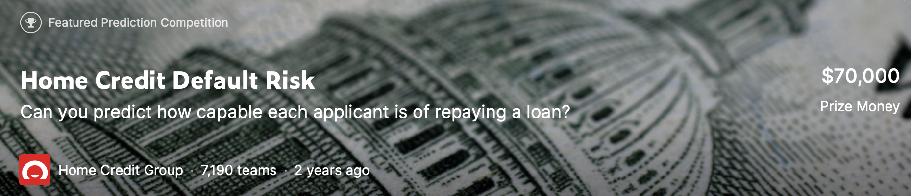

# Kaggle Competition: Home Credit Default Risk 
## (The JPFGM Team)



## Table of Contents
1. [Description](#project_overview)
2. [Getting Started](#getting_started)
	1. [Installing](#installing)
	2. [Results](#executing)
3. [Authors](#authors)
4. [License](#license)
5. [Acknowledgement](#acknowledgement)
6. [Publication](#published)

<a name="project_overview"></a>
## Project Overview

Many people struggle to get loans due to insufficient or non-existent credit histories. And, unfortunately, this population is often taken advantage of by untrustworthy lenders.
Home Credit strives to broaden financial inclusion for the unbanked population by providing a positive and safe borrowing experience. In order to make sure this underserved population has a positive loan experience, Home Credit makes use of a variety of alternative data--including telco and transactional information--to predict their clients' repayment abilities.
While Home Credit is currently using various statistical and machine learning methods to make these predictions, they're challenging Kagglers to help them unlock the full potential of their data. Doing so will ensure that clients capable of repayment are not rejected and that loans are given with a principal, maturity, and repayment calendar that will empower their clients to be successful.

What was done:

* Performed feature selection/engineering/PCA on data sets ranging from 48k-to-27.3m entries and 2-to-122 features. 
* Built a pipeline for training/testing with LightGBM and XGBoost and incorporated bayesian optimization of the hyperparameters.

<a name="getting_started"></a>
## Getting Started

<a name="installing"></a>
### Installing
Clone this GIT repository:
```
git clone https://github.com/JojoYY/JPFGM
```
<a name="executing"></a>
### Results:
Ranked top-14% among 7,198 teams competing (our AUC score: 0.79309, the winning score: 0.80570).


<a name="authors"></a>
## Authors

[Geovani Montoya](https://github.com/geovani-montoya), 
[Portfolio website](https://geovani-montoya.github.io), [LinkedIn](https://www.linkedin.com/in/geovani-montoya/)

[Feishu Wu](https://github.com/FeishuWu)

[Mark Rodighiero](https://www.linkedin.com/in/mark-rodighiero-5b923313/)

[Ponien Chiang](https://github.com/ponienchiang)

[Johanna](https://github.com/JojoYY)


<a name="license"></a>
## License
[](https://opensource.org/licenses/MIT)


